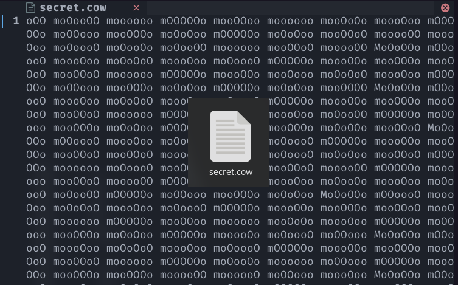
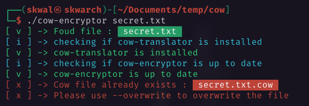
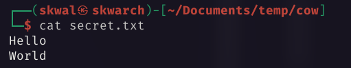
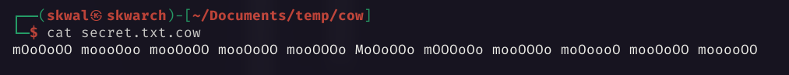
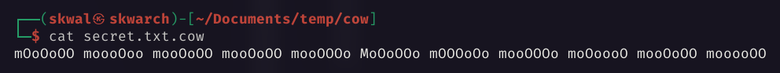
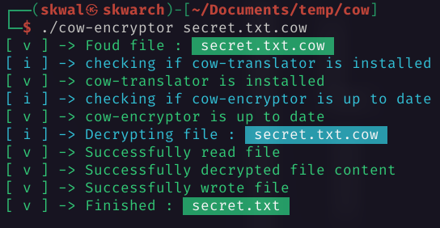
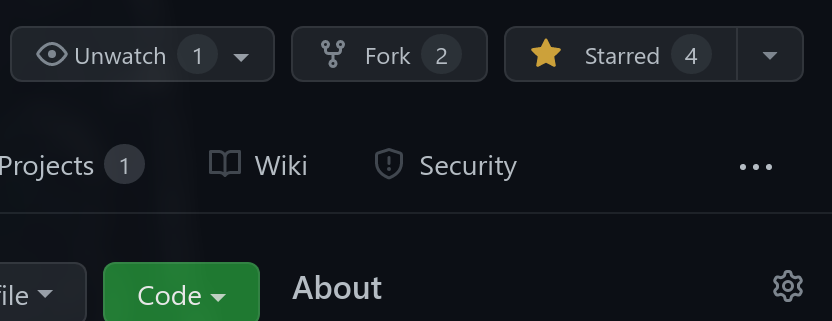

# Cow-encryptor



Encrypt your files in cow language 🐮

# Installation 📦

## Arch Linux 🐧

cow-encryptor is in the AUR

```bash
yay -S cow-encryptor
```

## Other 🪟🐧

### With make - Linux 🐧

Build with make

```bash
# 📂 cow-encryptor/
make
```

Copy the binary to bin folder

```bash
# 📂 cow-encryptor/
make install
```

### Build from source - Linux 🐧 & Windows 🪟

**Clone this repo**

```bash
git clone https://github.com/SkwalExe/cow-encryptor.git
```

build with [cargo](https://doc.rust-lang.org/cargo/getting-started/installation.html)

```bash
# 📂 cow-encryptor/
cargo build --release
```

**[ LINUX ONLY ] :** Move the binary

```bash
# 📂 cow-encryptor/
sudo cp target/release/cow-encryptor /usr/bin/cow-encryptor
```

**On windows** the executable will be `target\release\cow-encryptor.exe` you can move it wherever you want.

# Usage 📝


## --overwrite

Folder content : 


If you try 

```bash
cow-encryptor secret.txt
```

You will get the following error : 



Because a destination file already exists.

Use the --overwrite flag to overwrite the destination file.

## --encrypt

Enter encryption mode, the specified file will be encrypted.

Original file : 



```bash
cow-encryptor --encrypt secret.txt
```


Result : 



Encryption mode will be used by default if the file doens't have the `.cow` extension.

## --decrypt

Enter decription mode, the specified file will be decrypted.

Encrypted file : 



```bash
cow-encryptor [--decrypt] secret.txt.cow
```



The decryption mode will automatically be used if the file ends with `.cow`

## --print

With this option, the encrypted/decrypted file will be printed to the standard output instead if saving it to a file.

# Docker 🐳

## Run the latest version

```bash
docker run --rm -it ghcr.io/skwalexe/cow-encryptor:main
```

## Test your changes 🚧

### Build 🛠️

```bash
# 📂 cow-encryptor/
docker build -t cow-encryptor .
```

### Run 🏃

```bash
docker run --rm -it cow-encryptor [OPTIONS]
```

# Uninstall 🗑

## With make

Run make uninstall

```bash
# 📂 cow-encryptor/
make uninstall
```

## removing the binary

```bash
sudo rm /usr/bin/cow-encryptor
```

# Setting up development environment

For this project, I recommend Visual Studio Code.

You'll need to install the rust extension

```
ext install rust-lang.rust
```

# contributing

Start by **forking** this repository.



Then clone your fork to your local machine.

```git
git clone https://github.com/your-username/cow-encryptor.git
```

Create a new branch

```git
git checkout -b super-cool-feature
```

Then [edit the source code](#setting-up-development-environment) in the `📂/src/` folder.

Once you're done, commit your changes and push them to the remote repository.

```git
git add --all
git commit -m "Add super-cool-feature"
git push origin super-cool-feature
```

Then, open a pull request on GitHub from your fork.

# final

If you have any problem, don't hesitate to open an issue

<a href="https://github.com/SkwalExe#ukraine"></a>