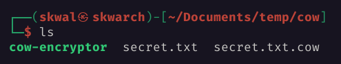
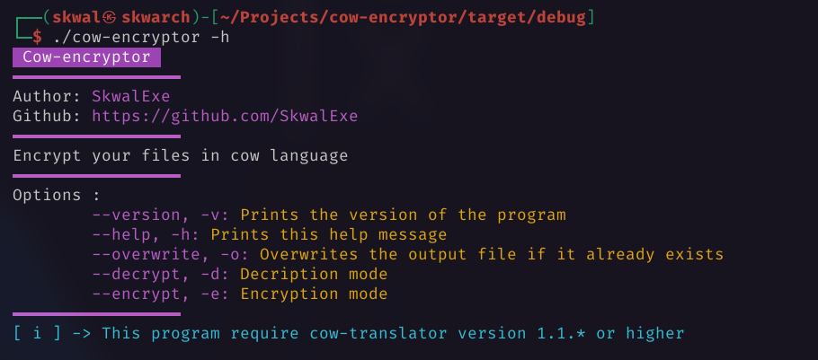

# ProgramName

Description

# Installation 📦

Installation instructions

# Usage 📝

How to use the program

# final

If you have any problem, don't hesitate to open an issue

# contributing

Pull requests are welcome. For major changes, please open an issue first to discuss what you would like to change.

